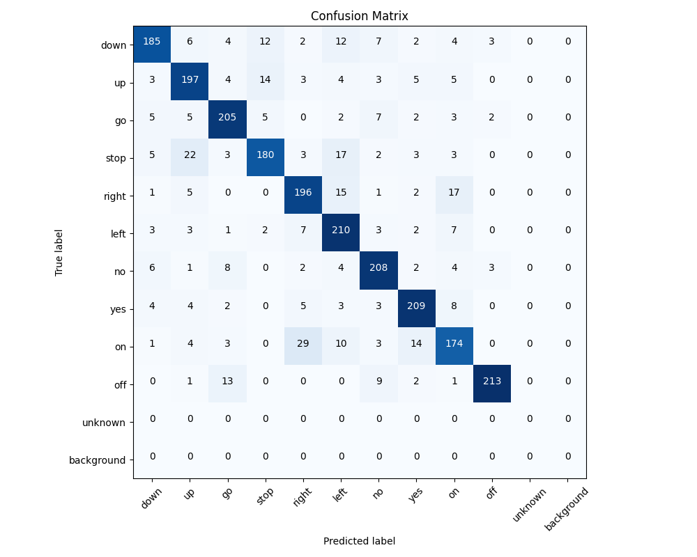
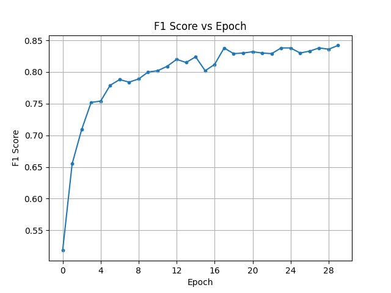
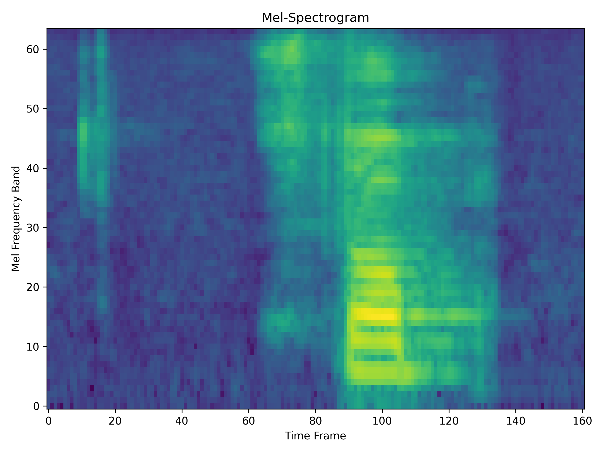
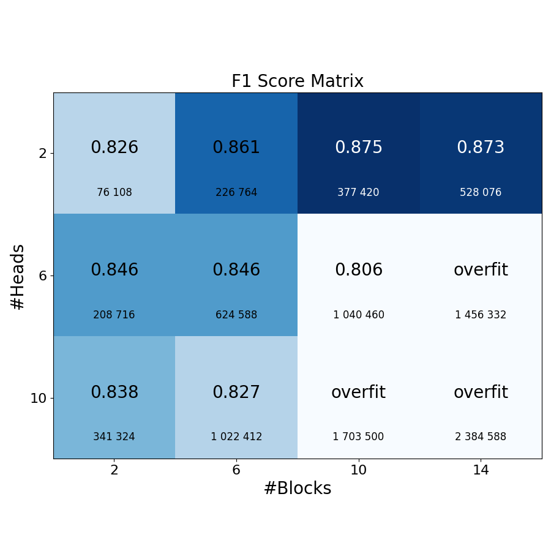

# Speech Recognition Project

## Introduction

This project is a part of the Summer Semester 2024/2025 Deep Learning course at the Warsaw University of Technology, Faculty of Mathematics and Information Sciences.

The aim of this project is to implement several deep learning architectures (mainly Transformers) to classify basic speech commands.

## Prepare the dataset

Since this dataset comes from a Kaggle competition, the official test data is provided without labels. Therefore, this project only uses the `train` data and splits it into `train`, `validation`, and `test` sets. You are, of course, more than welcome to use the unlabeled `test` data provided by Kaggle for your own experiments.

1. **Download the dataset**  
The dataset can be found [here](https://www.kaggle.com/c/tensorflow-speech-recognition-challenge/data). You need to find the download button (usually in the section `Data`, at the bottom)
2. **Extract the dataset**  
Extract the downloaded archive. Inside, you will find a `train.7z` archive. Extract it as well.
3. **Copy the `audio/` folder**  
Inside the extracted `train/` folder, you will find an `audio/` directory. Move this `audio/` directory to the root folder of this repository. You can now safely remove the rest of the downloaded archive.
4. **Create `unknown` class (optional)**
Run `create_unknown_class.py`
5. **Run `split_dataset.py`**  
Run the script to split the dataset. The processed files will be saved under a new `dataset/` directory. Once the process is complete, you can remove the original `audio/` directory to save disk space.


## Setup

**Linux**:

Create virual environment:
```{Bash}
python3 -m venv venv
source venv/bin/activate
```
Install required libraries:
```{Bash}
pip install torchaudio numpy matplotlib scikit-learn torchsummary torchcodec
```

Ensure you have `ffmpeg` installed. If not, run:
```{bash}
sudo apt update
sudo apt install ffmpeg
```

## Usage

After downloading the dataset, run `split_dataset.py` to split the dataset into train, validation, and test parts. (See the [Prepare the dataset](#prepare-the-dataset) section).

### Training

Select the desired parameters in `train.py` and run the file.
Models will be saved under `./models/`, with each model in a separate directory.
The model (and optimizer) will be saved after each epoch.

### Create confusion matrix

To create a confusion matrix, run `create_confusion_matrix.py`.
First, select the model (path and iteration) inside the `create_confusion_matrix.py` file.
The confusion matrix will be saved under the `images/` directory.
**Example confusion matrix:**


### Create a learning curve

To create a learning curve, run `create_learning_curve.py`.
First, select the model inside the `create_learning_curve.py` file.
The learning curve will be saved under the `images/` directory.

**Example learning curve:**


### Create a spectrogram

You can also create a spectrogram (image) of a given sound file. This process is independent of deep learning. To do so, run `create_spectrogram.py` (you can first select the file ID inside it). It will also be saved inside the `images/` directory.

**Example spectrogram:**


## Results
Experiments were conducted to determine the optimal number of blocks and the number of attention heads in each block. The results are presented below (the larger number represents the F1 score, and the smaller number below it indicates the number of parameters).
